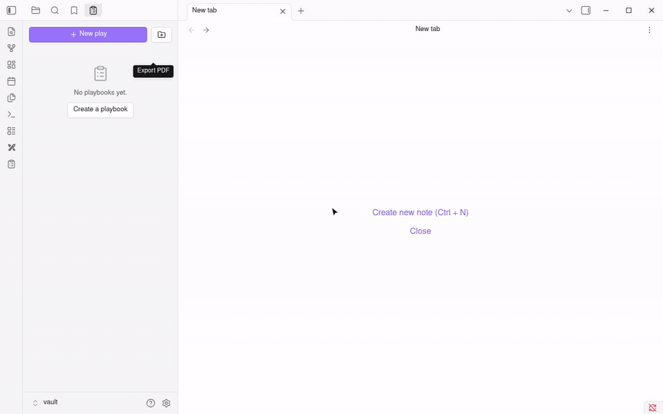

# Football Playbook

Design and organize American football playbooks in Obsidian. Plays are drawn with the [Excalidraw](https://github.com/zsviczian/obsidian-excalidraw-plugin) plugin, with the field and players already in place.



[Watch the full-speed video (MP4)](docs/demo.mp4)

## Features

- **Playbooks per team**: 11-man tackle, 9-man tackle or 5v5 flag, offense only or offense + defense.
- **New play in one click**: pick a formation and get a drawing with the field (yard lines, hashes, yard numbers, line of scrimmage) and every player lined up. Optionally show the opponent's formation faded behind.
- **Formation library**: built-in formations for each format, each one a drawing you can open, edit (move players, change labels), rename, duplicate or delete from the Formations section of the panel. You can also turn any play drawing into a formation with **Save current drawing as formation**. Deleted a built-in by mistake? Run **Restore built-in formations**.
- **Notes for every play**: general notes plus an assignments table with one row per player.
- **Playbook panel**: browse plays by side and formation; rename, duplicate or delete a play (note and drawing together) from its menu.
- **PDF export**: one button exports the team notes and every play, one per page.

## Getting started

1. Install **Football Playbook** and **Excalidraw** from Settings → Community plugins. The panel shows an install button if Excalidraw is missing.
2. Click the clipboard icon in the left ribbon to open the Playbooks panel.
3. Click **New playbook**, then **New play**.

## Where things are stored

Everything is plain files in your vault, so it syncs and backs up like any other note:

```
Playbooks/<Team>/Playbook.md                                team notes + settings (format, defense)
Playbooks/<Team>/Offense/<Formation>/<Play>.md              play notes and assignments
Playbooks/<Team>/Offense/<Formation>/<Play>.excalidraw.md   play drawing
Playbooks/<Team>/Export.md                                  generated by Export PDF
Playbooks/Formations/<Format>/<Offense|Defense>/<Name>.excalidraw.md   formation library
```

A formation's players are the shapes the plugin drew. To add a player to a formation, copy and paste an existing one; to rename a player, edit the letter inside it.

## Development

```bash
npm install
npm run dev      # rebuild on change
npm run lint     # Obsidian's review rules
npm test         # check built-in formations
npm run deploy   # build and copy into a test vault (set VAULT=/path/to/vault)
```

## Releasing

1. `npm version patch` (or `minor`/`major`) updates `package.json`, `manifest.json` and `versions.json`, commits and tags.
2. `git push --follow-tags`. The GitHub workflow builds and creates a draft release with `main.js`, `manifest.json` and `styles.css`.
3. Publish the draft release on GitHub.

First release only: submit the plugin to [obsidian-releases](https://github.com/obsidianmd/obsidian-releases) by adding an entry to `community-plugins.json`.
